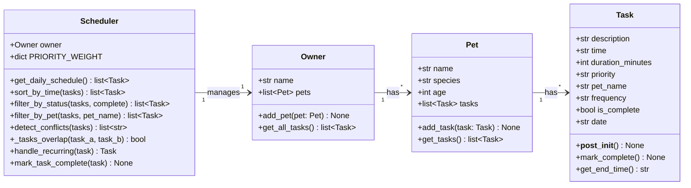

# PawPal+ Final System Architecture — UML Class Diagram

```mermaid
classDiagram
  direction LR

  class Task {
    +str description
    +str time
    +int duration_minutes
    +str priority
    +str pet_name
    +str frequency
    +bool is_complete
    +str date
    +__post_init__() None
    +mark_complete() None
    +get_end_time() str
  }

  class Pet {
    +str name
    +str species
    +int age
    +list~Task~ tasks
    +add_task(task: Task) None
    +get_tasks() list~Task~
  }

  class Owner {
    +str name
    +list~Pet~ pets
    +add_pet(pet: Pet) None
    +get_all_tasks() list~Task~
  }

  class Scheduler {
    +Owner owner
    +dict PRIORITY_WEIGHT
    +get_daily_schedule() list~Task~
    +sort_by_time(tasks) list~Task~
    +filter_by_status(tasks, complete) list~Task~
    +filter_by_pet(tasks, pet_name) list~Task~
    +detect_conflicts(tasks) list~str~
    +_tasks_overlap(task_a, task_b) bool
    +handle_recurring(task) Task
    +mark_task_complete(task) None
  }

  Owner "1" --> "*" Pet : has
  Pet "1" --> "*" Task : has
  Scheduler "1" --> "1" Owner : manages
```